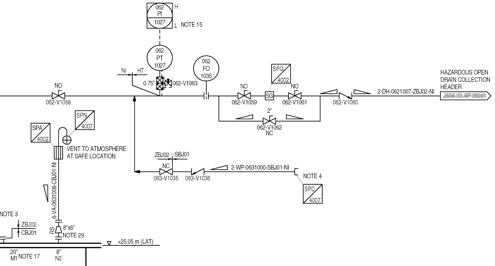
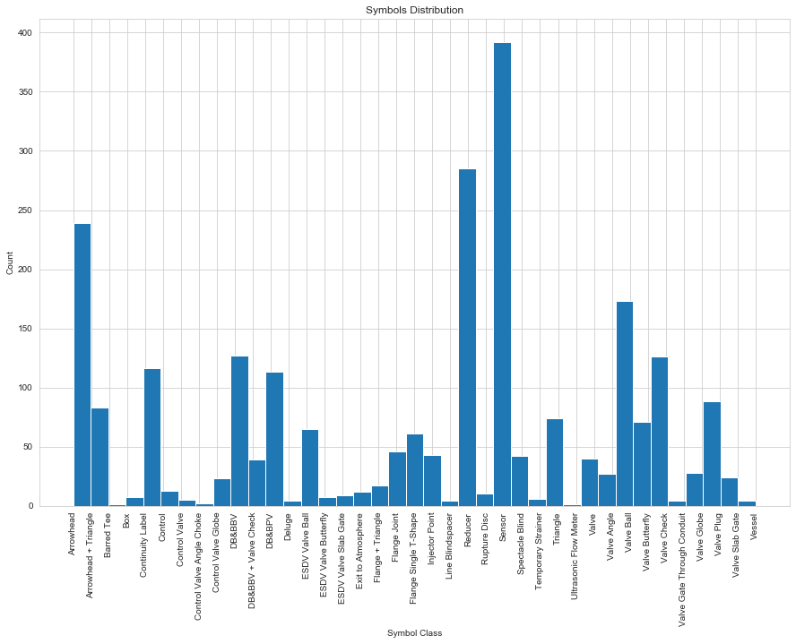
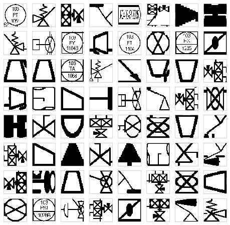

### Symbols Classification in Engineering Drawings

Engineering drawings are common across different domains such as Oil & Gas, construction, mechanical and other domains. Automatic processing and analysis of these drawings is a challenging task. This is partly due to the complexity of these documents and also due to the lack of dataset availability in the public domain that can help push the research in this area. 

This repo contains the code and data for hte paper that was presented at EANN2020. In this paper, we present a multiclass imbalanced dataset for the research community made of **2432** instances of engineering symbols. These symbols were extracted from a collection of complex engineering drawings known as Piping and Instrumentation Diagram -see figure below- (P&ID). By providing such dataset to the research community, we anticipate that this will help attract more attention to an important, yet overlooked industrial problem, and will also advance the research in such important and timely topics. We discuss the datasets characteristics in details, and we also show how Convolutional Neural Networks (CNNs) perform on such extremely imbalanced datasets. Finally, conclusions and future directions are discussed. 

#### Dataset

A multiclass imbalanced dataset for the research community made of **2432** instances of engineering symbols. These symbols were extracted from a collection of complex engineering drawings known as Piping and Instrumentation Diagram (P&ID). As can be seen below, the dataset is largerly imbalanced. 

The datasets contains wide range of symbols that are common in P&ID Diagrams. Each instance of these symbols were scaled to 100 by 100 pixels. 

#### Symbols Classification

The dataset was split into training and testing sets where 80% of the data was used for training and the remaining 20% for testing. The training set was then split into training and validation sets with ratios of 90% and 10% of the remaining training set respectively. The code for the CNN model training/ validation is available [here](notebook/) 

##### References 

If you use the dataset in this repository, please cite as follows: 

* E. Elyan, C.G. Moreno and P. Johnston, “Symbols in Engineering Drawings (SiED): An Imbalanced Dataset Benchmarked by Convolutional Neural Networks”, In 2020 International Joint Conference of the 21st EANN (Engineering Applications of Neural Networks), EANN 2020. Proceedings of the International Neural Networks Society, vol 2. Springer, Cham, DOI [https://doi.org/10.1007/978-3-030-48791-1_16](https://doi.org/10.1007/978-3-030-48791-1_16)

For more advanced methods to handle engineering diagrams, please see:

* E. Elyan, L Jamieson, A. A. Gombe, “Deep learning for symbols detection and classification in engineering drawings”, Neural Networks, 129:91-102, 2020, Elsevier, DOI [https://doi.org/10.1016/j.neunet.2020.05.025](https://doi.org/10.1016/j.neunet.2020.05.025)

**Note**: Paper citation/ url to follow
#### Comments / Questions 

You can reach me at [my staff page](https://www3.rgu.ac.uk/dmstaff/elyan-eyad) or on [linkedin](http://www.linkedin.com/in/elyan )

